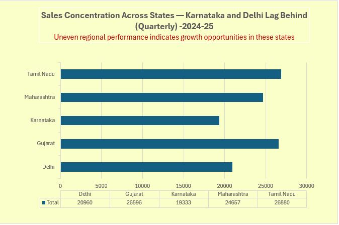
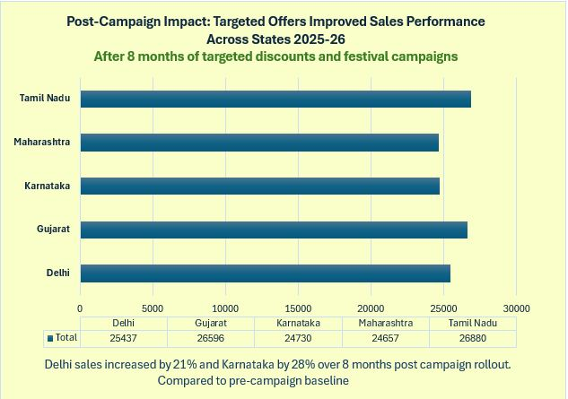

<h2>📊 Before vs After Campaign Impact</h2>

<table>
  <tr>
    <td align="center"><b>Before Campaign</b></td>
    <td align="center"><b>After Campaign</b></td>
  </tr>
  <tr>
    <td></td>
    <td></td>
  </tr>
</table>
<h2>📊 Before vs After Campaign Impact</h2>

<table>
  <tr>
    <td align="center"><b>Before Campaign</b></td>
    <td align="center"><b>After Campaign</b></td>
  </tr>
  <tr>
    <td></td>
    <td></td>
  </tr>
</table>
---

## 🧠 Business Problem
Sales in Karnataka and Delhi were lagging behind other major states, indicating uneven regional performance.

## 🔍 Insight
Analysis showed lower conversion and seasonal engagement in these regions compared to western and southern markets.

## 🎯 Action
Targeted discounts and festival-led campaigns (Diwali & holiday offers) were rolled out in Karnataka and Delhi.

## ⏱ Timeline
Campaigns were active for 8 months.

## 📈 Impact
Delhi sales increased by 21% and Karnataka by 28% compared to the pre-campaign baseline.

## 💡 Outcome
Sales distribution became more balanced, improving overall performance across regions.

